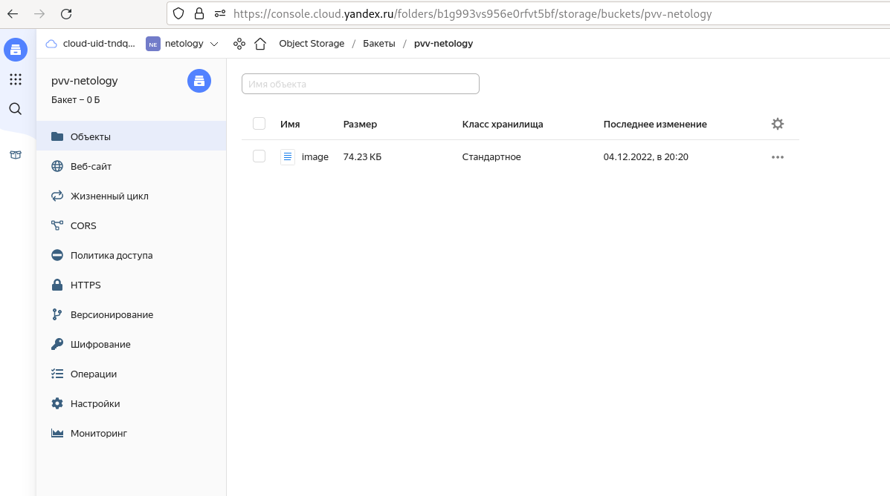
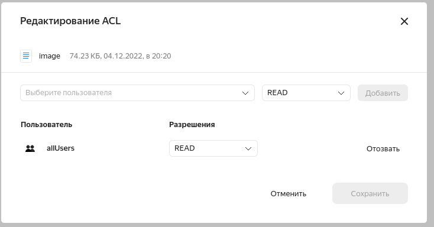

## 1. Создать bucket Object Storage и разместить там файл с картинкой:
- [манифест](./bucket.tf) для создания bucket

- [манифест](./object.tf) для загрузки картинки

- права на просмотр


## 2. Создать группу ВМ в public подсети фиксированного размера с шаблоном LAMP и web-страничкой, содержащей ссылку на картинку из bucket
- [манифест](./instance_group.tf) для создания instance group
- [user_data](./html.yml) для создания web странички
- Разместить в стартовой веб-странице шаблонной ВМ ссылку на картинку из bucket
```


```
- Настроить проверку состояния ВМ
```
  health_check {
    interval = 2
    timeout = 1
    healthy_threshold = 2
    unhealthy_threshold = 2
    http_options {
      path = "/"
      port = 80
    }
```
## 2. Подключить группу к сетевому балансировщику
- [манифест](./balancer_network.tf) для создания network balancer
- Проверить работоспособность, удалив одну или несколько ВМ
- - Остановка двух из трех машин

- - проверка остановки на балансировщике

- - проверка доступности web странички


